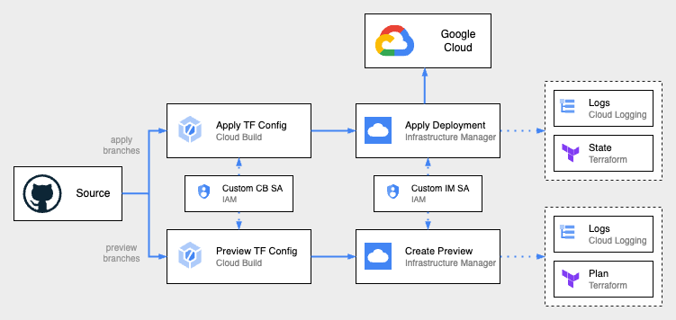

## Overview

This IM Cloud Build Workspace blueprint creates an opinionated workflow for actuating Terraform
resources on Cloud Build using Infrastructure Manager. A set of Cloud Build triggers manage
preview and apply operations on a configuration stored in a GitHub or GitLab repository.
The Cloud Build triggers use a per-workspace Service Account which can be configured with a
minimal set of permissions for calling Infrastructure Manager. Infrastructure Manager uses a separate
service account with a set of permissions required by the given Terraform configuration.

## Usage

Basic usage of this module is as follows:

```hcl
module "im-workspace" {
  source = "terraform-google-modules/bootstrap/google//modules/im_cloudbuild_workspace"
  version = "~> 11.0"

  project_id = var.project_id
  deployment_id = var.deployment_id
  im_deployment_repo_uri = var.im_deployment_repo_uri
  im_deployment_ref = var.im_deployment_ref

  github_app_installation_id = var.github_app_installation_id
  github_personal_access_token = var.github_personal_access_token
}
```

## Resources Created

This module creates:
- Two Cloud Build triggers with an inline build configuration for planning and applying Terraform configurations
using Infrastructure Manger. Additional optional build configurations can be specified.
- Optional custom Service Accounts and roles to be used for invoking Cloud Build and used in Infrastructure Manager
for actuating resources.
- Connections to GitHub or GitLab repositories.



## Notes

<!-- BEGINNING OF PRE-COMMIT-TERRAFORM DOCS HOOK -->
## Inputs

| Name | Description | Type | Default | Required |
|------|-------------|------|---------|:--------:|
| cloudbuild\_apply\_filename | Optional Cloud Build YAML definition used for Cloud Build triggers of Infra Manager apply. Defaults to using inline definition. | `string` | `""` | no |
| cloudbuild\_ignored\_files | Optional list. Changes only affecting ignored files will not invoke a build. | `list(string)` | `[]` | no |
| cloudbuild\_included\_files | Optional list. Changes affecting at least one of these files will invoke a build. | `list(string)` | `[]` | no |
| cloudbuild\_preview\_filename | Optional Cloud Build YAML definition used for Cloud Build triggers of Infra Manager preview. Defaults to using inline definition. | `string` | `""` | no |
| cloudbuild\_sa | Custom SA ID of form projects/{{project}}/serviceAccounts/{{email}} to be used for creating Cloud Build triggers. Creates one if not given. | `string` | `""` | no |
| custom\_cloudbuild\_sa\_name | Custom name to be used if creating a Cloud Build service account. Defaults to generated name if empty. | `string` | `""` | no |
| custom\_infra\_manager\_sa\_name | Custom name to be used if creating an Infrastructure Manager service account. Defaults to generated name if empty. | `string` | `""` | no |
| deployment\_id | Custom ID to be used for the Infrastructure Manager deployment. | `string` | n/a | yes |
| github\_app\_installation\_id | Installation ID of the Cloud Build GitHub app used for pull and push request triggers. | `string` | `""` | no |
| github\_pat\_secret | The secret ID within Secret Manager for an existing personal access token for GitHub. | `string` | `""` | no |
| github\_pat\_secret\_version | The secret version ID or alias for the GitHub PAT secret. Uses the latest if not provided. | `string` | `""` | no |
| github\_personal\_access\_token | Personal access token for a GitHub repository. If provided, creates a secret within Secret Manager. | `string` | `""` | no |
| gitlab\_api\_access\_token | GitLab personal access token with api scope. If provided, creates a secret within Secret Manager. | `string` | `""` | no |
| gitlab\_api\_access\_token\_secret | The secret ID within Secret Manager for an existing api access token for GitLab. | `string` | `""` | no |
| gitlab\_api\_access\_token\_secret\_version | The secret version ID or alias for the GitLab api token secret. Uses the latest if not provided. | `string` | `""` | no |
| gitlab\_host\_uri | The URI of the GitLab Enterprise host this connection is for. Defaults to non-enterprise. | `string` | `""` | no |
| gitlab\_read\_api\_access\_token | GitLab personal access token with read\_api scope. If provided, creates a secret within Secret Manager. | `string` | `""` | no |
| gitlab\_read\_api\_access\_token\_secret | The secret ID within Secret Manager for an existing read\_api access token for GitLab. | `string` | `""` | no |
| gitlab\_read\_api\_access\_token\_secret\_version | The secret version ID or alias for the GitLab read\_api token secret. Uses the latest if not provided. | `string` | `""` | no |
| host\_connection\_name | Name for the VCS connection. Generated if not given. | `string` | `""` | no |
| im\_deployment\_ref | Git branch or ref configured to run infra-manager apply. All other refs will run plan by default. | `string` | n/a | yes |
| im\_deployment\_repo\_dir | The directory inside the repo where the Terraform root config is located. If empty defaults to repo root. | `string` | `""` | no |
| im\_deployment\_repo\_uri | The URI of the repo where the Terraform configs are stored. | `string` | n/a | yes |
| im\_tf\_variables | Optional list of Terraform variables to pass to Infrastructure Manager, if the configuration exists in a different repo. List of strings of form KEY=VALUE expected. | `string` | `""` | no |
| infra\_manager\_sa | Custom SA id of form projects/{{project}}/serviceAccounts/{{email}} to be used by Infra Manager. Defaults to generated name if empty. | `string` | `""` | no |
| infra\_manager\_sa\_roles | List of roles to grant to Infrastructure Manager SA for actuating resources defined in the Terraform configuration. | `list(string)` | `[]` | no |
| location | Location for Infrastructure Manager deployment. | `string` | `"us-central1"` | no |
| project\_id | GCP project for Infrastructure Manager deployments and Cloud Build triggers. | `string` | n/a | yes |
| pull\_request\_comment\_control | Configure builds to run whether a repository owner or collaborator needs to comment /gcbrun. | `string` | `"COMMENTS_ENABLED_FOR_EXTERNAL_CONTRIBUTORS_ONLY"` | no |
| repo\_connection\_name | Connection name for linked repository. Generated if not given. | `string` | `""` | no |
| substitutions | Optional map of substitutions to use in builds if using a custom Cloud Build YAML definition. | `map(string)` | `{}` | no |
| tf\_cloudbuilder | Name of the Cloud Builder image used for running build steps. | `string` | `"hashicorp/terraform"` | no |
| tf\_repo\_type | Type of repo | `string` | `"GITHUB"` | no |
| tf\_version | Terraform version to use for Infrastructure Manager and the Cloud Builder image. | `string` | `"1.2.3"` | no |
| trigger\_location | Location of for Cloud Build triggers created in the workspace. Matches `location` if not given. | `string` | `"us-central1"` | no |

## Outputs

| Name | Description |
|------|-------------|
| cloudbuild\_apply\_trigger\_id | Trigger used for running infra-manager apply |
| cloudbuild\_preview\_trigger\_id | Trigger used for running infra-manager preview |
| cloudbuild\_sa | Service account used by the Cloud Build triggers |
| github\_secret\_id | The secret ID for the GitHub secret containing the personal access token. |
| gitlab\_api\_secret\_id | The secret ID for the GitLab secret containing the token with api access. |
| gitlab\_read\_api\_secret\_id | The secret ID for the GitLab secret containing the token with read\_api access. |
| infra\_manager\_sa | Service account used by Infrastructure Manager |
| repo\_connection\_id | The Cloud Build repository connection ID |
| vcs\_connection\_id | The Cloud Build VCS host connection ID |

<!-- END OF PRE-COMMIT-TERRAFORM DOCS HOOK -->

## Requirements

### Software

-   [Terraform](https://www.terraform.io/downloads.html) >= 1.3
-   [terraform-provider-google] plugin >= 3.50.x

### Permissions

### APIs

A project with the following APIs enabled must be used to host the
resources of this module:

```hcl
"config.googleapis.com",
"iam.googleapis.com",
"cloudbuild.googleapis.com",
"storage.googleapis.com",
```

## Contributing

Refer to the [contribution guidelines](../../CONTRIBUTING.md) for
information on contributing to this module.
