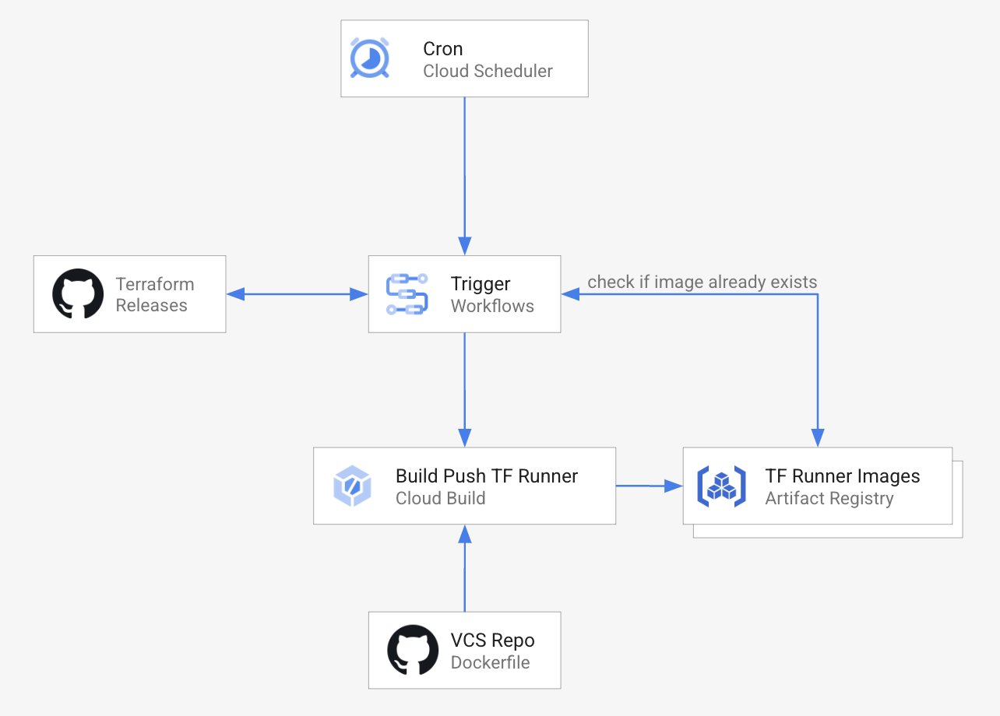

## Overview

TF Cloud Builder blueprint automates the creation and management of Terraform [Cloud Build Builder/Runner](https://cloud.google.com/build/docs/cloud-builders) images. These images are used in the context of build steps for automating Terraform deployments using Cloud Build.

## Usage

Basic usage of this module is as follows:

```hcl
module "tfbuilder" {
  source  = "terraform-google-modules/bootstrap/google//modules/tf_cloudbuild_builder"
  version = "~> 11.0"

  project_id          = module.enabled_google_apis.project_id
  dockerfile_repo_uri = "https://github.com/org/repo"
}
```

Sample Dockerfile and functional examples are included in the [examples](../../examples/) directory.

## Resources created

This module creates:
- Cloud Workflow for querying upstream Terraform releases, existing TF Builder images and triggering a Cloud Build build if an image does not exist for the latest Terraform release
- Cloud Build trigger with an inline build configuration for building and pushing a Dockerfile to an Artifact repository
- Artifact Registry Repository for storing TF Builder images
- Cloud Scheduler job for periodically triggering the Workflow



<!-- BEGINNING OF PRE-COMMIT-TERRAFORM DOCS HOOK -->
## Inputs

| Name | Description | Type | Default | Required |
|------|-------------|------|---------|:--------:|
| bucket\_name | Custom bucket name for Cloud Build logs. | `string` | `""` | no |
| build\_timeout | Amount of time the build should be allowed to run, to second granularity. Format is the number of seconds followed by s. | `string` | `"600s"` | no |
| cb\_logs\_bucket\_force\_destroy | When deleting the bucket for storing CloudBuild logs, this boolean option will delete all contained objects. If false, Terraform will fail to delete buckets which contain objects. | `bool` | `false` | no |
| cloudbuild\_sa | Custom SA email to be used by the CloudBuild trigger. Defaults to being created if empty. | `string` | `""` | no |
| dockerfile\_repo\_dir | The directory inside the repo where the Dockerfile is located. If empty defaults to repo root. | `string` | `""` | no |
| dockerfile\_repo\_ref | The branch or tag to use. Use refs/heads/branchname for branches or refs/tags/tagname for tags. | `string` | `"refs/heads/main"` | no |
| dockerfile\_repo\_type | Type of repo | `string` | `"CLOUD_SOURCE_REPOSITORIES"` | no |
| dockerfile\_repo\_uri | The URI of the repo where the Dockerfile for Terraform builder is stored. If using Cloud Build Repositories (2nd Gen) this is the repository ID where the Dockerfile is stored. Repository ID Format is 'projects/{{project}}/locations/{{location}}/connections/{{parent\_connection}}/repositories/{{name}}' | `string` | `""` | no |
| enable\_worker\_pool | Set to true to use a private worker pool in the Cloud Build Trigger. | `bool` | `false` | no |
| gar\_repo\_location | Name of the location for the Google Artifact Repository. | `string` | n/a | yes |
| gar\_repo\_name | Name of the Google Artifact Repository where the Terraform builder images are stored. | `string` | `"tf-runners"` | no |
| image\_name | Name of the image for the Terraform builder. | `string` | `"terraform"` | no |
| project\_id | GCP project for Cloud Build trigger,workflow and scheduler. | `string` | n/a | yes |
| terraform\_version | The initial terraform version in semantic version format. | `string` | `"1.1.0"` | no |
| trigger\_location | Location of the Cloud Build trigger building the Terraform builder. If using private pools should be the same location as the pool. | `string` | n/a | yes |
| trigger\_name | Name of the Cloud Build trigger building the Terraform builder. | `string` | `"tf-cloud-builder-build"` | no |
| use\_cloudbuildv2\_repository | Use Cloud Build repository (2nd gen) | `bool` | `false` | no |
| worker\_pool\_id | Custom private worker pool ID. Format: 'projects/PROJECT\_ID/locations/REGION/workerPools/PRIVATE\_POOL\_ID'. | `string` | `""` | no |
| workflow\_deletion\_protection | Whether Terraform will be prevented from destroying the workflow. When the field is set to true or unset in Terraform state, a `terraform apply` or `terraform destroy` that would delete the workflow will fail. When the field is set to false, deleting the workflow is allowed. | `bool` | `true` | no |
| workflow\_name | Name of the workflow managing builds. | `string` | `"terraform-runner-workflow"` | no |
| workflow\_region | The region of the workflow. | `string` | `"us-central1"` | no |
| workflow\_sa | Custom SA email to be used by the workflow. Defaults to being created if empty. | `string` | `""` | no |
| workflow\_schedule | The workflow frequency, in cron syntax | `string` | `"0 8 * * *"` | no |

## Outputs

| Name | Description |
|------|-------------|
| artifact\_repo | GAR Repo created to store TF Cloud Builder images |
| cloudbuild\_sa | SA used by Cloud Build trigger |
| cloudbuild\_trigger\_id | Trigger used for building new TF Builder |
| scheduler\_id | Scheduler ID for periodically triggering TF Builder build Workflow |
| workflow\_id | Workflow ID for triggering new TF Builder build |
| workflow\_sa | SA used by Workflow for triggering new TF Builder build |

<!-- END OF PRE-COMMIT-TERRAFORM DOCS HOOK -->

## Requirements

### Software

-   [Terraform](https://www.terraform.io/downloads.html) >= 1.3
-   [terraform-provider-google] plugin >= 3.50.x

### Permissions

- `roles/artifactregistry.admin`
- `roles/cloudscheduler.admin`
- `roles/cloudbuild.builds.editor`
- `roles/workflows.admin`
- `roles/iam.serviceAccountAdmin`
- `roles/iam.securityAdmin`

### APIs

A project with the following APIs enabled must be used to host the
resources of this module:

```hcl
"iam.googleapis.com",
"compute.googleapis.com",
"workflows.googleapis.com",
"artifactregistry.googleapis.com",
"cloudbuild.googleapis.com",
"cloudscheduler.googleapis.com"
```

If using Cloud Source Repositories, `"sourcerepo.googleapis.com"` API must also be enabled.

## Contributing

Refer to the [contribution guidelines](../../CONTRIBUTING.md) for
information on contributing to this module.
