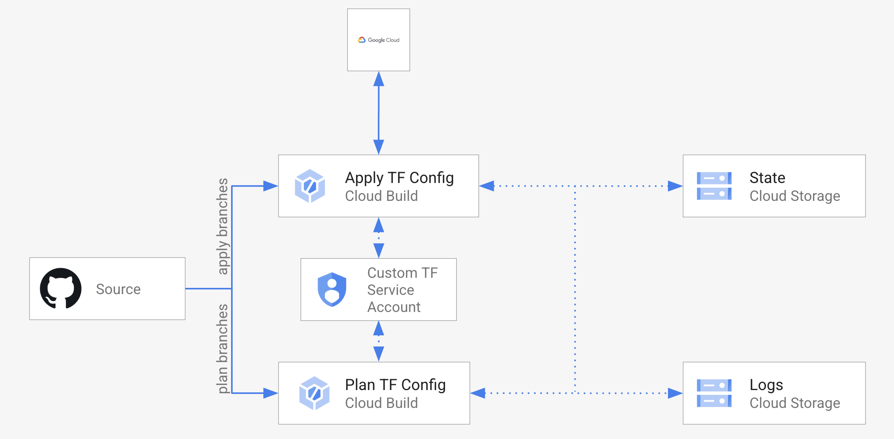

## Overview

TF Cloud Build Workspace blueprint creates an opinionated workflow for actuating Terraform on Cloud Build. A set of Cloud Build triggers manage plan and apply operations on a root configuration stored in a VCS repo. Cloud Build triggers use a per workspace Service Account which can be configured with minimal permissions required by a given Terraform configuration. Optionally dedicated GCS buckets for state and log storage are also created.

## Github Requirements for Cloud Build Connection

When using a Cloud Build 2nd generation repository, a Cloud Build connection to your repository provider will be needed. For Github connections you will need:

- [Install Cloud Build App on Github](https://github.com/apps/google-cloud-build).
- [Create Personal Access Token on Github with `repo` and `read:user` (or if app is installed in org use `read:org`)](https://docs.github.com/en/authentication/keeping-your-account-and-data-secure/creating-a-personal-access-token).

For more information on this topic refer to the ["Connect with Github Documentation"](https://cloud.google.com/build/docs/automating-builds/github/connect-repo-github?generation=2nd-gen)

## Usage

Basic usage of this module is as follows:

```hcl
module "tf-net-workspace" {
  source  = "terraform-google-modules/bootstrap/google//modules/tf_cloudbuild_workspace"
  version = "~> 11.0"

  project_id          = var.project_id
  tf_repo_uri         = "https://github.com/org/tf-config-repo"
  cloudbuild_sa_roles = { var.project_id = ["roles/compute.networkAdmin"] }
}
```

Functional examples are included in the [examples](../../examples/) directory.

## Resources created

This module creates:
- Two Cloud Build triggers with an inline build configuration for planning and applying Terraform configuration. Optionally custom in repo build configs can be specified.
- Optional custom Service Account and roles for that SA used by Cloud Build triggers.
- GCS buckets for storing Terraform state, logs, and plans.



## Notes
- When a custom Service Account is provided via `cloudbuild_sa` and `diff_sa_project` is `true` (i.e SA is in a different project) follow [these instructions](https://cloud.google.com/build/docs/securing-builds/configure-user-specified-service-accounts#cross-project_set_up) to confirm `iam.disableCrossProjectServiceAccountUsage` org policy is not enforced in the SA project.
- If a custom build config is specified via `cloudbuild_plan/apply_filename`, a log bucket must be specified in the build config. For ease of use, we populate `_LOG_BUCKET_NAME` as a [substitution](https://cloud.google.com/build/docs/configuring-builds/substitute-variable-values) and can be used like `logsBucket: 'gs://$_LOG_BUCKET_NAME'`.

<!-- BEGINNING OF PRE-COMMIT-TERRAFORM DOCS HOOK -->
## Inputs

| Name | Description | Type | Default | Required |
|------|-------------|------|---------|:--------:|
| artifacts\_bucket\_name | Custom bucket name for Cloud Build artifacts. | `string` | `""` | no |
| buckets\_force\_destroy | When deleting the bucket for storing CloudBuild logs/TF state, this boolean option will delete all contained objects. If false, Terraform will fail to delete buckets which contain objects. | `bool` | `false` | no |
| cloudbuild\_apply\_filename | Optional Cloud Build YAML definition used for terraform apply. Defaults to using inline definition. | `string` | `null` | no |
| cloudbuild\_env\_vars | Optional list of environment variables to be used in builds. List of strings of form KEY=VALUE expected. | `list(string)` | `[]` | no |
| cloudbuild\_ignored\_files | Optional list. Changes only affecting ignored files will not invoke a build. | `list(string)` | `[]` | no |
| cloudbuild\_included\_files | Optional list. Changes affecting at least one of these files will invoke a build. | `list(string)` | `[]` | no |
| cloudbuild\_plan\_filename | Optional Cloud Build YAML definition used for terraform plan. Defaults to using inline definition. | `string` | `null` | no |
| cloudbuild\_sa | Custom SA id of form projects/{{project}}/serviceAccounts/{{email}} to be used by the CloudBuild trigger. Defaults to being created if empty. | `string` | `""` | no |
| cloudbuild\_sa\_roles | Optional to assign to custom CloudBuild SA. Map of project name or any static key to object with project\_id and list of roles. | <pre>map(object({<br>    project_id = string<br>    roles      = list(string)<br>  }))</pre> | `{}` | no |
| create\_cloudbuild\_sa | Create a Service Account for use in Cloud Build. If false `cloudbuild_sa` has to be specified. | `bool` | `true` | no |
| create\_cloudbuild\_sa\_name | Custom name to be used in the creation of the Cloud Build service account if `create_cloudbuild_sa` is true. Defaults to generated name if empty | `string` | `""` | no |
| create\_state\_bucket | Create a GCS bucket for storing state. If false `state_bucket_self_link` has to be specified. | `bool` | `true` | no |
| create\_state\_bucket\_name | Custom bucket name for storing TF state. Used if `create_state_bucket` is true. Defaults to generated name if empty. | `string` | `""` | no |
| diff\_sa\_project | Set to true if `cloudbuild_sa` is in a different project for setting up https://cloud.google.com/build/docs/securing-builds/configure-user-specified-service-accounts#cross-project_set_up. | `bool` | `false` | no |
| enable\_worker\_pool | Set to true to use a private worker pool in the Cloud Build Trigger. | `bool` | `false` | no |
| location | Location for build logs/state bucket | `string` | `"us-central1"` | no |
| log\_bucket\_name | Custom bucket name for Cloud Build logs. | `string` | `""` | no |
| prefix | Prefix of the state/log buckets and triggers planning/applying config. If unset computes a prefix from tf\_repo\_uri and tf\_repo\_dir variables. | `string` | `""` | no |
| project\_id | GCP project for Cloud Build triggers, state and log buckets. | `string` | n/a | yes |
| state\_bucket\_self\_link | Custom GCS bucket for storing TF state. Defaults to being created if empty. | `string` | `""` | no |
| substitutions | Map of substitutions to use in builds. | `map(string)` | `{}` | no |
| tf\_apply\_branches | List of git branches configured to run terraform apply Cloud Build trigger. All other branches will run plan by default. | `list(string)` | <pre>[<br>  "main"<br>]</pre> | no |
| tf\_cloudbuilder | Name of the Cloud Builder image used for running build steps. | `string` | `"hashicorp/terraform:1.3.10"` | no |
| tf\_repo\_dir | The directory inside the repo where the Terrafrom root config is located. If empty defaults to repo root. | `string` | `""` | no |
| tf\_repo\_type | Type of repo. When the repo type is CLOUDBUILD\_V2\_REPOSITORY, it will use the generic Cloudbuild 2nd gen Repository API. | `string` | `"CLOUD_SOURCE_REPOSITORIES"` | no |
| tf\_repo\_uri | The URI of the repo where Terraform configs are stored. If using Cloud Build Repositories (2nd Gen) this is the repository ID where the Dockerfile is stored. Repository ID Format is 'projects/{{project}}/locations/{{location}}/connections/{{parent\_connection}}/repositories/{{name}}'. | `string` | `""` | no |
| trigger\_location | Location of for Cloud Build triggers created in the workspace. If using private pools should be the same location as the pool. | `string` | n/a | yes |
| worker\_pool\_id | Custom private worker pool ID. Format: 'projects/PROJECT\_ID/locations/REGION/workerPools/PRIVATE\_POOL\_ID'. | `string` | `""` | no |

## Outputs

| Name | Description |
|------|-------------|
| artifacts\_bucket | Bucket for storing TF plans |
| cloudbuild\_apply\_trigger\_id | Trigger used for running TF apply |
| cloudbuild\_plan\_trigger\_id | Trigger used for running TF plan |
| cloudbuild\_sa | SA used by Cloud Build triggers |
| logs\_bucket | Bucket for storing TF logs |
| state\_bucket | Bucket for storing TF state |

<!-- END OF PRE-COMMIT-TERRAFORM DOCS HOOK -->

## Requirements

### Software

-   [Terraform](https://www.terraform.io/downloads.html) >= 1.3
-   [terraform-provider-google] plugin >= 3.50.x

### Permissions

- `roles/cloudbuild.builds.editor`
- `roles/storage.admin`
- `roles/iam.serviceAccountCreator`

### APIs

A project with the following APIs enabled must be used to host the
resources of this module:

```hcl
"iam.googleapis.com",
"compute.googleapis.com",
"cloudbuild.googleapis.com",
```

## Contributing

Refer to the [contribution guidelines](../../CONTRIBUTING.md) for
information on contributing to this module.
